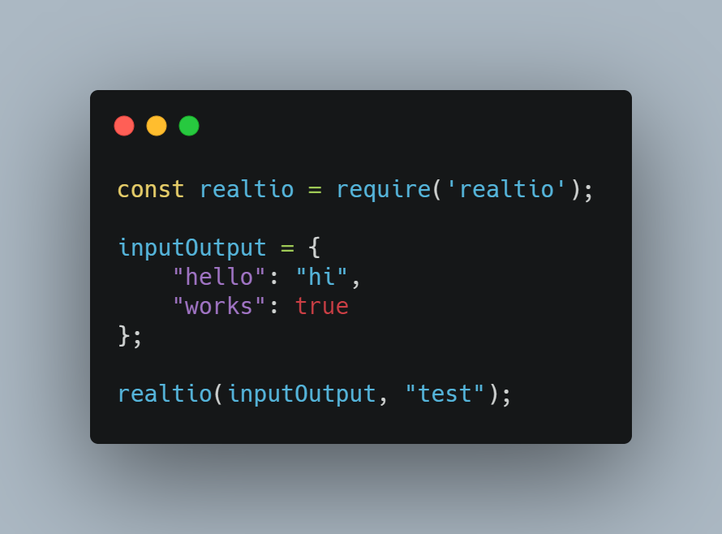
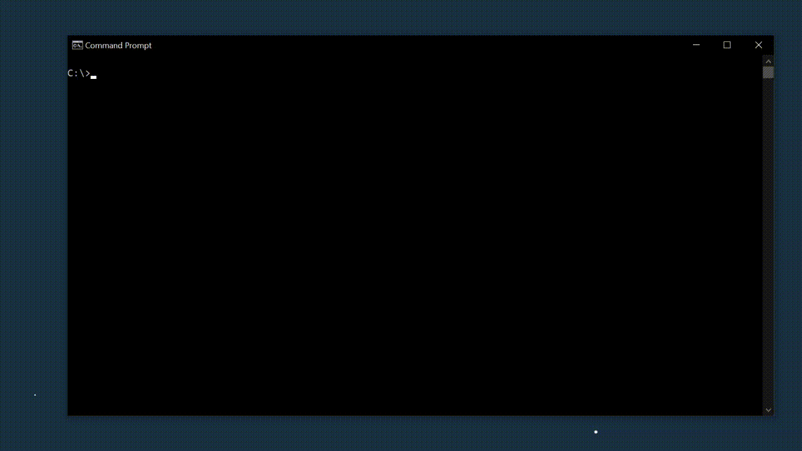

# realtio

A simple node package to take in inputs and display outputs in realtime onto the CLI.

## Installation

```
npm install realtio
```

## Parameters

### Input-output values

`Required`

- Key - input
- Value - output

### Prompt

`Optional`

Text, if any, to be displayed before the input.

## Example



CLI commands which don't engage any other directory can also be run directly by pressing enter.
